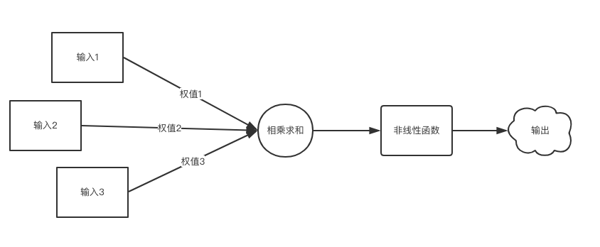

# Tensorflow

## 深度神经网络模型





## 机器学习的三要素
* 数据
* 算法
* 算力


##  神经网络搭建的八股
1. 数据集
2. 前向传播（构建计算图）
3. 反向传播（优化参数:损失函数、学习率、滑动平均、正则化） 
4. 训练网络（迭代训练网络）

### 网络结构
**前向传播**

>定义网络计算图，主要定义神经元间的大小、权重、偏移量

```
def forward(x, regularizer):
	w= 
	b= 
	y= 
	return y
	
def get_weight(shape, regularizer):
	w = tf.Variable()
	tf.add_to_collection('losses', tf.contrib.layers.l2_regularizer(regularizer)(w))
    return w

def get_bias(shape):
    b = tf.Variable()  
    return b
```

*tf.add\_to\_collection('losses', tf.contrib.layers.l2_regularizer(regularizer)(w)) 表示把每一个w的正则化损失加入总损失losses中*


**反向传播**
>训练神经网络，优化网络参数

```
```
