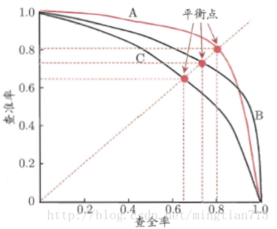
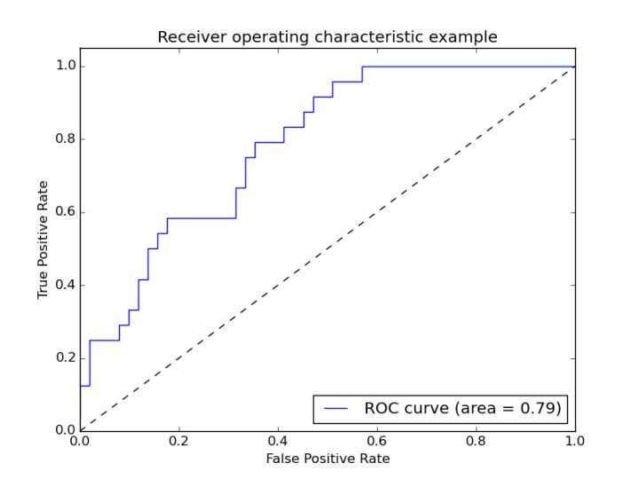
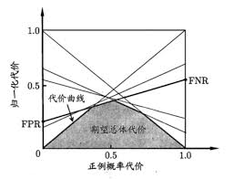
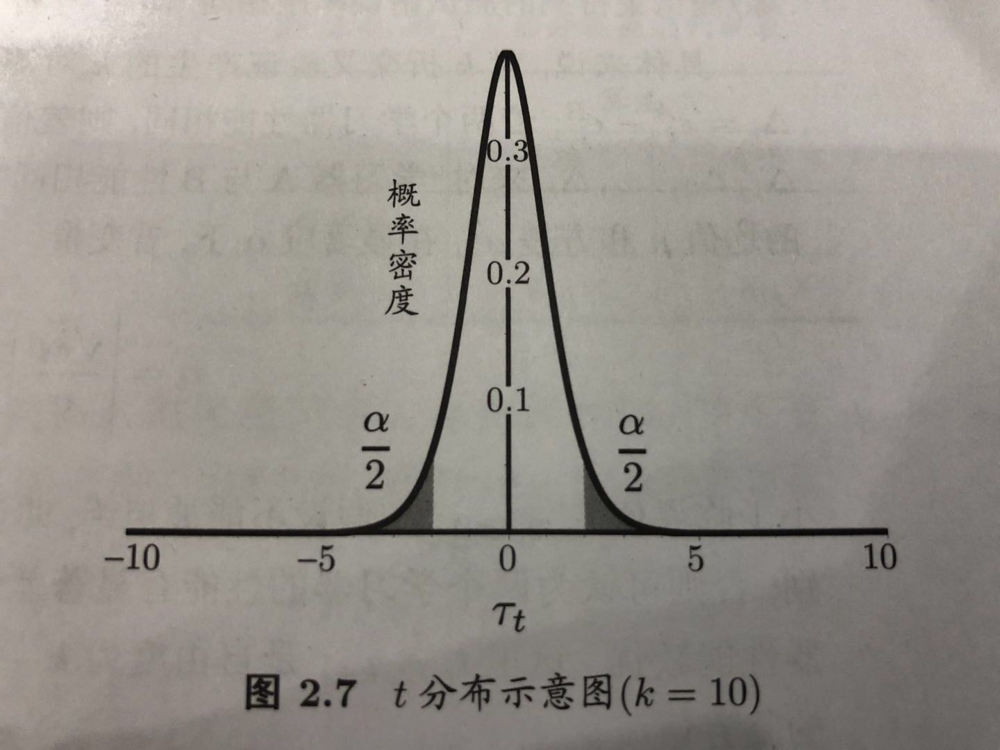

# 机器学习（周志华）——概念篇

## 第一章 绪论
###1.1 绪论
* 机器学习(machine learning): 研究如何通过计算的手段，经过经验来改善系统自身的性能，“经验”通常以“数据”的形式存在。机器学习所研究的主要内容是关于在计算机上从数据中产生“模型”（model）的算法，即学习算法(learning algorithm)。

###1.2 基本术语

* 属性(attribute) / 特征(feature)：反映事件或对象在某方面的表现或性质的事项。
  - 例：西瓜(对象)的色泽(属性1)、根蒂(属性2)、敲声(属性3)。
* 属性值(attribute value)：属性上的取值。
  - 例：对于色泽：有属性值乌黑、青绿两种取值。
* 样本(sample) / 示例（instance）/ 特征向量(feature vector)：用属性上的具体属性值来反映某一个对象或者事物。
  - 例：（色泽=青绿，根蒂=蜷缩，敲声=浊响）
* 样本空间(sample space):属性张成的空间。
  - 例：把“色泽”、“根蒂”、“敲声” 分别作为三个坐标轴，则张成一个用于描述西瓜的三维空间。
* 数据集(data set)：
  - 令$D = {x_1 ,x_2,...,x_m}$, 表示包含m个示例的数据集。假设每个示例由$d$个属性表示，则 $x_i = (x_{i1},x_{i2},...,x_{id})$是d维样本空间中的一个向量，其中$x_{ij}$是 $x_i$ 在第$j$个属性上的取值。$d$称为$x_i$的维数(dimensionality)。
  
* 学习(learning) / 训练(training): 从数据中通过执行某个学习算法来获得模型的过程。模型也可称为学习器(learner)。
* 训练数据(training data): 训练过程中使用的数据。
* 训练样本(training sample): 训练数据中的每一个样本。
* 训练集(training set): 训练样本组成的集合。
* 假设(hypothesis): 学得模型对应关于数据的某种潜在规律。
* 真实(ground-truth): 潜在规律自身。
* 标记(label): 示例的结果信息。
  - 例：((色泽=青绿，根蒂=蜷缩，敲声=浊响)，好瓜)，好瓜称为标记。

* 样例(example): 拥有标记信息的示例。一般用($x_i$,$y_i$)表示第$i$个样例。其中$y_i$ 属于 Y 是$x_i$的标记，Y是所有标记的集合，称为标记空间。
* 标记空间(label space): 所有标记的集合。
* 分类(classification): 预测的是离散值。
* 回归(regression): 预测的是连续值。
* 聚类(clustering): 将训练集中的示例分成若干个组，每组称为一个簇(cluster)，自动形成的簇对应一些潜在概念的划分，例如把西瓜分成了“浅色瓜”，“深色瓜”，“本地瓜”，“外地瓜”等。注意，聚类学习中的标记是事先不知道的，学习中使用的训练样本中不含有标记信息。
* 监督学习(supervised learning): 训练数据具有标记信息。如：分类和回归。
* 无监督学习(unsupervised learning): 训练数据不具有标记信息。如：聚类。
* 泛化(generalization): 学得模型适用于新样本的能力。
* 独立同分布(idenpendent and identically distributed，简称i.i.d.): 获得的每个样本都是独立地从一个未知分布上采样得到的。

###1.3 假设空间
* 归纳(induction): 从特殊到一般的泛化过程，即从具体的事实归结出一般性规律。
* 演绎(deduction): 从一般到特殊的特化(specialization)过程，即从基础原理推演出具体情况。
* 假设空间(hypothesis space): 学习过程可以看成一个在所有假设组成的空间中进行搜索的过程，假设的表示一旦确定，假设空间及其规模大小也就确定了。
  - 例： 西瓜有三个属性来判断是否为好瓜，分别是色泽、根蒂、敲声。假设每种属性有三种取值。针对一个属性，除了通过特定取值来判断是否为好瓜外，还可能当前属性为无关因素，即任何值都可以，用通配符（*）来表示。除此之外，还可以好瓜概念根本不存在，用空集表示。那么，对于有三个属性，每种属性有三个取值的问题的假设空间规模大小为：$（3+1）\times（3+1）\times（3+1）+1 = 4 \times 4 \times 4 +1 = 65 $ 种。

* 版本空间(version space): 与训练集一致的“假设集合”。即包含标记为“是”，不包含标记为“否”的假设集合。

###1.4 归纳偏好
* 归纳偏好(inductive bias): 机器学习算法在学习过程中对某种属性假设的偏好。
* 奥卡姆剃刀(Occam's razor): “若有多个假设与观察一致，则选最简单的那个”。

## 第二章 模型评估与选择
###2.1 经验误差与过拟合
* 错误率(error rate): 分类错误的样本数占样本总数的比例。
  - 例：如果在m个样本中有a个样本分类错误，则错误率E=a/m
* 精度(accuracy): 精度=1-错误率
* 误差(error): 学习器的实际预测输出与样本的真实输出之间的差异。
* 训练误差(training error)/经验误差(empirical error): 学习器在训练集上的误差。
* 泛化误差(generalization error): 新样本上的误差。
* 过拟合(overfitting): 当学习器把训练样本学得“太好”了的时候，很可能已经把训练样本自身的一些特点当作了所有潜在样本都会具有的一般性质，这样就会导致泛化性能下降，这种现象称为“过拟合”。
* 欠拟合(underfitting): 指对训练样本的一般性质尚未学好。

### 2.2 评估方法
* 测试误差(testing error): 使用一个测试机来测试学习器对新样本的判别能力，然后将测试集上的测试误差作为泛化误差的近似。

 #### 2.2.1 留出法(hold-out)
 * 留出法：将数据集D划分为两个互斥的集合，其中一个集合作为训练集S，另一个作为测试集合T，即D为S和T的并集，S和T的交集为空。在S上训练出模型后，用T来评估测试误差。
 * 分层采样(stratified sampling):  训练集和测试集的划分要尽可能保持数据分布的一致性，在分类问题上，样本的类别的比例要相似。这种保留类别比例的采样方式称为“分层采样”。
 
 #### 2.2.2 交叉验证法(cross validation)
 * 交叉验证法：将数据集D划分为k个大小相似的互斥子集，D为$D_1、D_2、D_3...D_k$的并集，每个子集D_i都尽可能保持数据分布一致性，即从D中分层采样得到。然后每次用$k-1$个子集的并集作为训练集，剩余的一个作为测试集。从而得到$k$组训练/测试集。进行$k$组实验，最后结果返回为$k$个测试结果的均值。
 * $k$折交叉验证(k-fold cross validation)：交叉验证的结果的稳定性和保真性在很大程度上取决于k的取值。k取几时，就称为几折交叉验证。
 * 留一法(Leave-One-Out,简称LOO)：假定数据集D中包含m个样本，若令k=m，留一法不受随机样本划分方式的影响，因为m个样本只有唯一的划分方式，即每个子集只有一个样本。
 
 #### 2.2.3 自助法(bootstrapping)
 * 自助法：给定包含m个样本的数据集D，进行采样产生数据集 $D'$: 每次随机从D中挑选一个样本，将其拷贝放入 $D'$，然后再将该样本放回初始数据集D中，使得该样本在下次采样时仍有可能被采到，重复此过程m次，即有放回的采样m次，就得到了m个样本的数据集 $D'$，$D'$就是自助采样的结果。
 * 包外估计(out-of-bag estimate): 在自助采样的过程中，有一部分样本数据会重复多次出现，而另一部分样本不出现，将采样的结果$D'$作为训练集，剩下的部分作为测试集，将没有出现在训练集的样本用于测试，这样的测试结果称为“包外估计”。
 
 #### 2.2.4 调参和最终模型
 * 调参(parameter tuning): 一般情况下，对每个参数选定一个范围和步长变化。如：[0,0.2]之间以0.05为步长，则候选参数就有5个。
 * 最终模型：给定包含m个样本的数据集D，一部分作为训练集，一部分作为测试集，这样训练出的模型只用了训练数据来确定算法和参数。当算法和参数选定后，应该用所有的m个样本数据来训练模型，这个模型就是最终模型。
 * 验证集(validation set): 模型评估过程中用于测试的数据称为“验证集”。学得模型在实际使用过程中遇到的数据称为测试数据。
 
### 2.3 性能度量
* 性能度量(performance measure): 衡量模型泛化能力的评估标准。
 
 #### 2.3.1 错误率与精度
 * 错误率(error rate): 适用于分类任务，分类错误的样本数占样本总数的比例。
 * 精度(accuracy):适用于分类任务，分类正确的样本数占样本总数的比例。

 ####2.3.2 查准率、查全率和F1
 * 混淆矩阵(confusion matrix)：对于二分类问题，可将样例根据其真实类别与学习器预测类别的组合划分为真正例(true positive,TP)，假正例(false positive,FP)，真反例(true negative,TN)，假反例(false negative,FN)。这四种情况：TP+FP+TN+FN=样本总数。结果可用如下混淆矩阵显示：
 	<table>
   <tr >
      <td rowspan="2">真实情况</td>
      <td colspan="2" align="center">预测结果</td>
   </tr>
   <tr>
      <td>正例</td>
      <td>反例</td>
   </tr>
   <tr>
      <td>正例</td>
      <td>TP</td>
      <td>FN</td>
   </tr>
   <tr>
      <td>反例</td>
      <td>FP</td>
      <td>TN</td>
   </tr>
</table>

 * 查准率(precision)：
   P=TP/(TP+FP)
 * 查全率(recall):
   R=TP/(TP+FN)
   查准率和查全率通常是一对矛盾度量，查准率高时，查全率通常偏低，查全率高时，查准率偏低。
 * P-R曲线：以查准率为纵轴，查全率为横轴的图。

      
 * 平衡点(Break-Even Point, BEP): 查准率=查全率时的取值，用于判断学习器的优劣，一般取值越高，学习器越优。
 * F1度量： $$ F1 = {2 \times P \times R \over P+R} = {2 \times TP \over 样例总数+TP-TN } $$
 * $F_\beta$度量：不同应用中对查全率和查准率的倾向不尽相同，在推荐系统中，更希望推荐用户感兴趣的，这时更推荐查准率。在逃犯检索系统中，不能遗漏逃犯，此时更倾向于查全率。因此有了F1度量的一般形式 $ F_\beta$:$$ F_\beta = {(1+\beta^2) \times P \times R \over P+R} = {2 \times TP \over 样例总数+TP-TN } $$ 当$\beta>0$时,度量了查全率对查准率的相对重要性，$\beta=1$ 时退化为标准F1度量；$\beta>1$时，查全率更重要，$\beta<1$时，查准率更重要。
 * 宏F1(macro-F1): 当有多个二分类混淆矩阵（进行多次训练/测试得到多个混淆矩阵，或者在多个数据集上训练/测试得到多个混淆矩阵，或者多分类任务中，两两类别组合的混淆矩阵得到多个混淆矩阵），要综合考察查全率和查准率。先在各混淆菊展上分别计算出查准率和查全率,记为$(P_1,R_1),(P_2,R_2),...,(P_n,R_n)$，再计算平均值，就得到宏查全率和宏查准率。
$$ macro-P = {\frac 1n} \sum_{i=1}^n P_i$$
$$ macro-R = {\frac 1n} \sum_{i=1}^n R_i$$
$$ macro-F1 = {2 \times macro-P \times macro-R \over macro-P + macro-R}$$
 * 微F1(micro-F1):将各矩阵的元素进行平均，得到 $ \overline {TP}、\overline {FP}、\overline {TN}、\overline {FN}$,再基于这些平均值计算得:
$$ micro-P = {\overline {TP} \over \overline {TP} + \overline {FP} }$$
$$ micro-R = {\overline {TP} \over \overline {TP} + \overline {FN} }$$
$$ micro-F1 = {2 \times micro-P \times micro-R \over micro-P + micro-R}$$

 #### 2.3.3 ROC和AUC
 * 受试者工作特征(Receiver Operating Characteristic,ROC): 根据不同的阈值划分出正例和反例,纵轴为真正例率(True Positive Rate, TPR)，横轴为假正例率(False Positive Rate,FPR).
$$ TPR = {TP \over TP + FN}$$
$$ FPR = {FP \over TN + FP}$$
 * ROC绘图过程：给定$m^+$个正例和$m_-$个反例，根据学习器预测结果排序，然后把分类阈值设到最大，即使得所有样例均预测为反例，此时真正例率和假正例率均为0，则在坐标(0,0)处标记一个点，然后将分类阈值依次设为每个样例的预测值，即将每个样例划分为正例，设前一个坐标为$(x,y)$,当前若为真正例，则对应的标记点的坐标为$(x,y+{ \frac 1 {m^+}})$, 若当前为假正例，则对应的标记点的坐标为$(x+{ \frac 1 {m^-}},y)$, 然后将相邻点用线段连接起来即得：
 
 * ROC曲线下面积(Area Under ROC Curve, AUC): 利用ROC曲线来评判学习器优劣的一种依据。通过ROC上各个坐标点${(x_1,y_1),(x_2,y_2),...,(x_,,y_m)}$,求得：
 $$ AUC = {\frac 1 2 \sum_{i=1}^{m-1} (x_{i+1}-x_i) \cdot (y_i+y_{i+1}) }$$
    
 #### 2.3.4 代价敏感错误率和代价曲线
 * 代价矩阵(cost matrix):用来权衡不同错误类型导致的不同程度的损失（非均等代价, unequal cost）。如下表所示, $cost_{ij}$表示把第$i$类样本预测为第$j$类样本的代价。
  <table>
   <tr >
      <td rowspan="2">真实类别</td>
      <td colspan="2" align="center">预测类别</td>
   </tr>
   <tr>
      <td>第0类</td>
      <td>第1类</td>
   </tr>
   <tr>
      <td>第0类</td>
      <td align="center">0</td>
      <td>$cost_{01}$</td>
   </tr>
   <tr>
      <td>反例</td>
      <td>$cost_{10}$</td>
      <td align="center">0</td>
   </tr>
  </table>
  
      在非均等代价下，不再是希望预测错误次数最少，而是希望最小化总体代价(total cost),若将表中的第0类作为正例，第1类作为反例，令$D^+$和$D^-$分别代表样例集$D$的正例子集和反例子集，则代价敏感(cost sensitive)错误率为：
      $$F(f;D;cost) = {\frac 1m \left(\sum_{x_i \in D^+} \rm II(f(x_i) \neq y_i ) \times cost_{01} + \sum_{x_i \in D^-} \rm II(f(x_i) \neq y_i ) \times cost_{10} \right)}$$
 * 代价曲线(cost curve):反应出学习器的期望总体代价。横轴为取值为[0,1]的正例概率代价，纵轴为[0,1]的归一化代价。
         
         正概率代价:(其中p为样例为正率的概率)
         $$P(+)cost = {{p \times cost_{01}} \over {p \times cost_{01} + (1-p) \times cost_{10}}}$$
         
         归一化代价:（FPR为假正率，FNR是假反率，FNR = 1-TPR)
         $$ cost_{norm} = {FNR \times p \times cost_{01} + FPR \times (1-p) \times cost_{10} \over {p \times cost_{01} + (1-p) \times cost_{10}}} $$
  代价曲线的绘制： ROC上的每一点对应了代价平面上的一条线段，设ROC曲线上的点的坐标为(FPR,TPR), 则可计算出FNR，然后在代价平面上绘制一条从(0,FPR)到(1,FNR)的线段，线段下的面积即表示了该条件下的期望总体代价；如此将ROC曲线上的每个点转化为代价平面上的一条线段，然后取所有所有线段的下届，围成的面积即为在所有条件下学习器的期望总体代价，如下图所示：
    
 

### 2.4 比较检验
* 假设检验(hypothesis test): 通过测试集上的观察，比较两种学习器在泛化性能上的优劣。

 #### 2.4.1 假设检验
 * 泛化错误率为$\epsilon$的学习器在m个样本的测试集上被测得测试错误率为 $\hat\epsilon$的概率：$$P({\hat\epsilon} ;\epsilon) = { \binom{m}{\hat\epsilon \times m} \epsilon^{\hat\epsilon \times m} (1-\epsilon)^{m- \hat\epsilon \times m} }$$
 给定测试错误率 $\hat\epsilon$，$P({\hat\epsilon} ;\epsilon)$ 在$\hat\epsilon = \epsilon$时最大，$|\epsilon - \hat\epsilon \ |$增大时，  $P({\hat\epsilon} ;\epsilon)$ 减小，符合二项分布(binomial distribution)。
 * 二项分布(binomial distribution): 即重复n次的伯努利试验（Bernoulli Experiment），即在每次试验中只有两种可能的结果，而且两种结果发生与否互相对立，并且相互独立，与其它各次试验结果无关，事件发生与否的概率在每一次独立试验中都保持不变。如果事件发生的概率是P,则不发生的概率q=1-p，N次独立重复试验中发生K次的概率是 $P(ξ=K)= \binom{n}{k} * p^k * (1-p)^{n-k}，其中\binom{n}{k}=n!/(k!(n-k)!)$。
 * 二项检验(binomial test): 比如要验证泛化错误率$\epsilon \le \epsilon_0 $,可取一个置信度(confidence)为$1-\alpha$，求在这个置信区间内能观测到的最大错误率：$$ \bar \epsilon = max \epsilon = \sum_{i=\epsilon_0 \times m +1}^{m} \binom m i \epsilon^i(1-\epsilon)^{m-i} \lt \alpha$$, 若测试错误率$\hat \epsilon$小于临界值$\bar \epsilon$,则可得出结论，在$\alpha$显著度下，假设"$\epsilon \le \epsilon_0$"不能被拒绝，即在$1-\alpha$置信度下，泛化错误率小于等于$ \epsilon_0$。
 * t检验(t-test):通过$k$次重复留出法或是交叉验证法得到了$k$个训练\测试集上的$k$个测试率，$\hat{\epsilon_1},\hat{\epsilon_2},...\hat{\epsilon_k}$，则平均测试错误率为$\mu$,方差为$\sigma^2$：$$\mu = \frac 1 k \sum_{i=1}^k \hat \epsilon_i$$,$$\sigma^2 = \frac 1 {k-1} \sum_{i=1}^k{(\hat \epsilon_i - \mu)^2}$$,将$k$个测试错误率可看作泛化错误率$\epsilon_0$的独立采样，则变量$$\tau_t={\sqrt k (\mu-\epsilon_0) \over \sigma}$$,服从自由度为$k-1$的$t$分布:
 
 对假设"$\mu = \epsilon_0$和显著度$\alpha$，可计算出当测试错误率为$\epsilon_0$时，在$1-\alpha$的概率内能观测到的最大错误率即为临界值。
 * 双边假设(two-tailed hypothesis): 上图中，两边阴影部分各有$\frac \alpha a$的面积，假定阴影部分范围分别为$[-∞,t_{-\alpha \over 2}]$和$[t_{\alpha \over 2},∞]$，若平均错误率
$\mu$和$\epsilon_0$之差$|\mu - \epsilon_0|$位于临界值范围$[t_{-\alpha \over 2},t_{\alpha \over 2}]$内，则不能拒绝假设"$\mu = \epsilon_0$" 

 #### 2.4.2 交叉验证$t$检验
  * 成对t检验(paired t-tests):用来比较两个学习器，利用k折交叉验证法得到的测试错误率分别为$\epsilon_1^A,\epsilon_2^A,...,\epsilon_k^A,$和$\epsilon_1^B,\epsilon_2^B,...,\epsilon_k^B$,其中$\epsilon_i^A 和 \epsilon_i^B$ 是在相同的第$i$折训练/测试集上得到的结果，先对每对结果求差$\Delta_i = \epsilon_i^A - \epsilon_i^B$;得到k个差值$\Delta_1,\Delta_2,...,\Delta_k$,来学习器A和B性能相同做$t$检验,计算均值$\mu$和方差$\sigma^2$，在显著度$\alpha$下，若变量$$\tau_t = |{\sqrt k \mu \over \sigma}|$$小于临界值$t_{\alpha \over 2,k-1}$,表示自由度为$k-1$的$t$分布上的尾部积累分布为$\alpha \over 2$的临界值,则不能拒绝假设，即认为两个学习器的性能没有明显差别；否则，认为两个学习器有差别，且平均错误率较小的学习器的性能更优。
  
  
### 2.5 偏差与方差
 * 偏差-方差分解(bias-variance decomposition): 对学习算法的期望泛化错误率进行拆解。令$x$为测试样本，$y_D$为$x$在数据集中的标记，$y$为$x$的真实标记，$f(x;D)$为训练集$D$上学得模型$f$在$x$上的预测输出，以回归任务为例，学习器的期望预测为$$\bar f(x) = E_D[f(x;D)]$$,使用样本数相同的不同训练集产生的方差为$$var(x) = E_D[(f(x;D)- \bar f(x))^2]$$，噪声为$$\epsilon^2 = E_D[(y_D-y)^2]$$, 期望输出与真实标记的偏差为:$$bias^2(x)= (\bar f(x)-y)^2$$, 假定期望噪声为0，则通过多项式展开合并可得：$$E(f;D)=bias^2(x)+var(x)+\epsilon^2$$,也就是说泛化误差可分解为偏差、方差、噪声之和。
 * 偏差(bias)：度量了学习算法的期望预测与真实结果的偏离程度。即反映了算法本身的拟合能力。
 * 方差(variance):度量了同样大小的训练集的变动所导致的学习性能的变化，即反映了数据扰动所造成的影响。
 * 噪声(noise):表达了在当前任务上任何学习算法所能达到的期望泛化误差的下界，即反映了问题本身的难度。

## 第三章 线性模型
